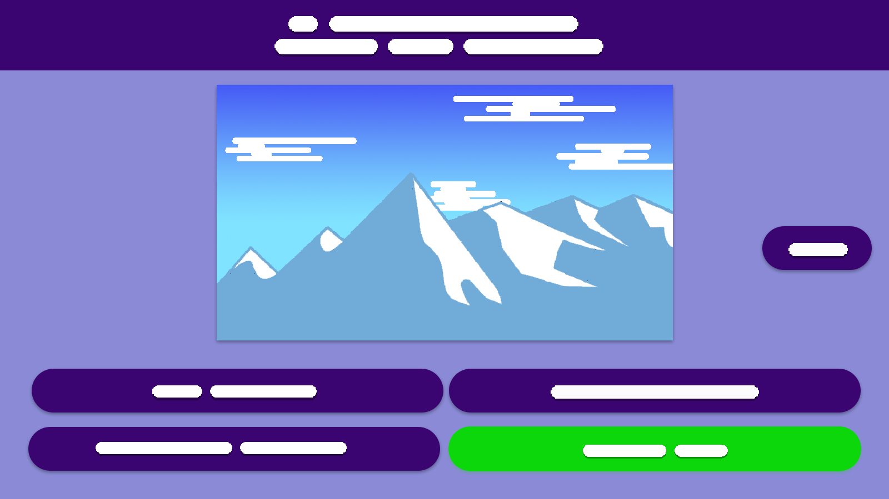
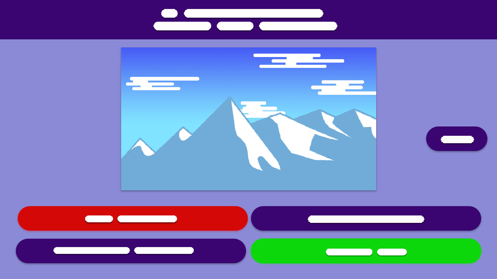

# Áttekintés
Egy olyan játékot készítünk, amellyel a fiatalok játékosan gyarapíthatják földrajzi tudásukat. Ennek egy hatékony eszköze a kvíz. Ez egyben az oktató számára is hasznos lesz, ugyanis ki lehet szakadni a szürke hétköznapokból és megfelelve a mai kor követelményeinek, a számítógép mellett telefonon és tableten is elérhető lesz online platformunk. Ez a rendszer teljesen ingyenes lesz, bárki le tudja majd tölteni, vagy az interneten keresztül beregisztrál és máris hozzáfér. Az elérhető témák között lesznek majd városok, nevezetességek Magyarországról is, de szerte a világból. A kvíz végeztével az adott személy láthatja mennyi pontot szerzett, ez százalékos formában is megtalálható lesz, ezáltal kap egy visszaigazolást hogy mennyire sikerült elsajátítania az adott témakört.

# Jelenlegi helyzet
A megrendelő célja, hogy bővítse az általa nyújtott oktatási szolgáltatásokat. Egy új rendszer lefejlesztését rendelte meg, amely interneten keresztül modern megoldásokat használva működik, és a XXI. század követelményei szerint elérhető számítógépen és mobilon is. Az online platform segítséget fog nyújtani földrajz tárgyból, hogy a diákok szélesebb körben megismerkedjenek a világ érdekességeivel játékos módon. Mindeddig csak matematika tárgyból használtak hasonló alkalmazást, de annyira tetszett a diákoknak, hogy a megrendelő felismerte, hogy ezzel a játékos oktatóprogrammal sokkal eredményesebbé teheti az oktatást, szemben a hagyományos táblára írással. Ezért megkért minket, hogy készítsük el számára a kívánt alkalmazást, ami sokkal aktívabbá és szórakoztatóbbá tudják tenni az oktatást.

# Követelménylista
|Modul|ID|Név|Verzió|Kifejtés|
|-----|--|---|------|--------|
|Jogosultság|K1|Bejelentkezési felület|1.0|A felhasználó bejelentkezhet e-mail címe és jelszava segítségével. Ha valamelyik nem megfelelő, akkor a felhasználó hibaüzenetet kap.|
|Jogosultság|K2|Regisztráció|1.0|A felhasználó a nevének, e-mail címének és jelszavának megadásával regisztrálhatja magát. Ha valamelyik adat hiányzik, hibaüzenetet kap.
|Jogosultság|K3|Jogosultsági szintek|1.0|Admin: új feladat feltöltése. Felhasználó: feladatok kitöltése, eredmények megtekintése, jelszó módosítása.|
|Feladattípus|K4|Kvíz|1.0|Több kérdésből áll, 4 válaszlehetőségből pontosan 1 válasz helyes. A kvíz végén megkapja az elért pontszámot a felhasználó.|

# Jelenlegi üzleti folyamatok modellje
A mai gyorsan változó technológiai világot nem tudta lekövetni még az oktatás. A diákok egyre kevésbé hajlandóak a tradícionális módon tanulni, mindenki a telefonját használja. Jelenleg a diákok tankönyvből tanulnak és papír alapú dolgozatokat írnak, amely nem csak hogy elavultnak számít, de nem is túl környezetbarát és az oktatóknak rengeteg idejük elmegy az egyesével történő javítással. Online platformunk erre fog egy kiváló megoldást biztosítani első körben földrajz tantárgyból.

# Igényelt üzleti folyamatok modellje
Mind a diákok, mind a tanárok számára nagy megkönnyebbülést fog hozni az online platformunk elkészülése. A diákoknak izgalmasabb órákat fog jelenteni, a tanárok számára pedig nyugodtabb délutánokat, ugyanis nem kell többet a javítással bajlódniuk, rögtön a kvíz kitöltése után automatikus visszajelzést kapnak a diákok az elért pontszámukról és hibás válaszok esetén a helyes választ is rögtön megtudják. Ráadásul a kérdések random sorrendje biztosítja hogy nem mindenki azonos sorrendben kapja azokat.

# Használati esetek
Admin: Beléphet minden más szerepkörbe, hogy a hibamentes működést ellenőrizhesse. Az ő feladatuk a rendszer problémamentes működtetése. Ez azt jelenti, hogy a teljes rendszerhez van hozzáférésük.

Felhasználó: Csak a saját feladatával tud foglalkozni, kvízeket kitölteni, más játékosok eredményét nem tudja megtekinteni.

# Képernyő tervek
A projektünkhöz csak számítógépes megjelenítést tervezünk, ebből látható pár terv. A GUI-t letisztult, könnyen kezelhetőre terveztük.

Kép a kvíz megjelenéséről

Válaszadás után a kép mellett megjelenik egy gomb, amellyel a következő kérdést tudjuk betölteni.
Ha a felhasználó helyesen válaszol egy adott kérdésre, akkor a válasz gombja zöldre változik.

Helytelen válasz esetén a választott válasz gombja pirosta változik, és a helyes válasz gombja zöldre.

# Forgatókönyv

A felhasználó a menübe lépést követően kiválaszt egy kvíz sorozatot. Betöltődik a kérdés, a kép, illetve a négy válaszlehetőség. A játékosnak a válaszadásra nincs időlimitje. A felhasználó válaszol a kérdésre a négy opció közül, majd a helyes válasz gombja zöldre vált. Emellett megjelenik a *tovább gomb* amellyel a következő kérdés töltődik be. Ha helyesen válaszol kap egy pontot, ha helytelenül 0 pontot kap, emellett a GUI-n a válasza piros színre vált.

# Fogalomszótár
### html
- A HTML (angolul: HyperText Markup Language, „hiperszöveges jelölőnyelv”) egy leíró nyelv, melyet weboldalak készítéséhez fejlesztettek ki 
### css
- A CSS (Cascading Style Sheets, magyarul: „lépcsőzetes stíluslapok”) a számítástechnikában egy stílusleíró nyelv, mely a HTML vagy XHTML típusú strukturált dokumentumok megjelenését írja le.
### javascript
- A JavaScript programozási nyelv egy objektumorientált, prototípus-alapú szkriptnyelv, amelyet weboldalakon elterjedten használnak.
### GUI
- A grafikus felhasználói felület vagy grafikus felhasználói interfész (angolul graphical user interface, röviden GUI) a számítástechnikában olyan, a számítógép és ember közti kapcsolatot megvalósító elemek összessége, melyek a monitor képernyőjén szöveges és rajzos elemek együtteseként jelennek meg. A grafikus felhasználói felületeken alapvető szerepe van a mutatóeszközök, például az egér használatának, amelyekkel a grafikus felület elemei intuitív módon, a fizikai világ egyfajta modelljeként kezelhetők.
### jogosultság
 - Az informatikában a hozzáférési jogosultság feladata a számítógép erőforrásainak vagy magának a számítógépes hálózatnak a védelme illetéktelen felhasználástól. Ezért gyakran összekeverik a felhasználóazonosítással (authentication).
### admin
 - A rendszergazda vagy admin egy számítógépes rendszer felügyeletéért felelős személy. A szoftveres, hardveres és hálózati problémák megoldását is ő végzi, illetve ő hozza létre az egyes felhasználókat és azok jogosultságait is. A számítógépek esetében a rendszergazda (admin, root) jogosultságú felhasználó rendelkezik azzal a hatáskörrel, hogy programokat telepítsen és törölje és megváltoztassa a számítógép alapbeállításait, létrehozzon és töröljön felhasználói fiókokat.