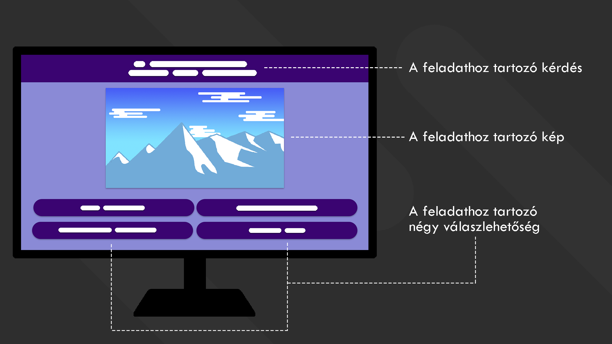

# Áttekintés

# Jelenlegi helyzet

# Követelménylista

# Jelenlegi üzleti folyamatok modellje

# Igényelt üzleti folyamatok modellje

# Használati esetek

# Képernyő tervek
A projektünkhöz csak számítógépes megjelenítést tervezünk, ebből látható pár terv. A GUI-t letisztult, könnyen kezelhetőre terveztük.

Kép a kvíz megjelenéséről

Válaszadás után a kép mellett megjelenik egy gomb, amellyel a következő kérdést tudjuk betölteni.
Ha a felhasználó helyesen válaszol egy adott kérdésre, akkor a válasz gombja zöldre változik.

Helytelen válasz esetén a választott válasz gombja pirosta változik, és a helyes válasz gombja zöldre.

# Forgatókönyv

# Fogalomszótár