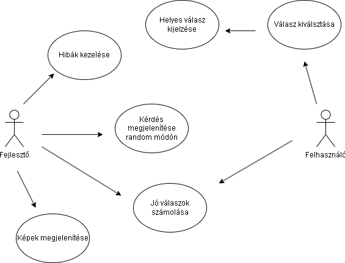
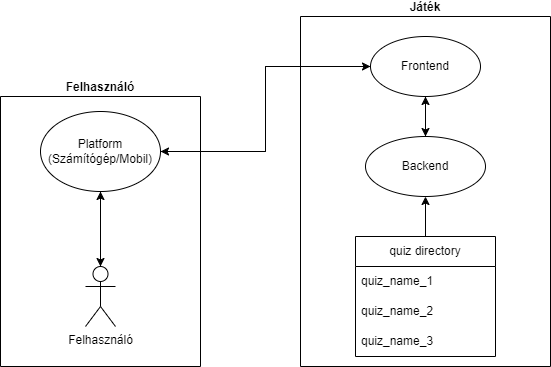
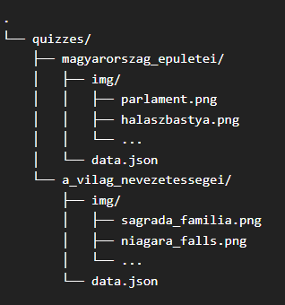

# Rendszer célja
A tájékozottság és tudás folyamatos fejlesztése fontos szempont mindannyiunk számára. A tudásszint ellenőrzésére és gyarapításár aegy hatékony eszköz a kvíz, ami nemcsak megméretteti velünk a tudásunkat, hanem motivál a tanulásban is. Ezen elvek mentén építkezve, célunk egy olyan online platform létrehozása, ahol a felhasználók képesek kibővíteni földrajzi ismereteiket, illetve tudásukat próbára tenni. Az oldalunkon több kategóriában is találhatóak kvízek. Az elérhető témák között szerepelnek városok, természeti nevezetességek. Az oldalunk nem csupán szórakoztat, hanem lehetőséget kínál az ismeretek elmélyítésére és a világ felfedezésére.

A játék során kérdésekre kell válaszolni. Minden esetben 4 válaszlehetőség áll rendelkezésre, és ezekből pontosan egy válasz helyes. Minden helyes válaszért egy pot jár, helytelenért pedig 0 pont. Cél a minnél több pont megszerzése (minnél több helyes válasz megadása). A játék végén egy oldalon jelenik meg a felhasználó által megadott helyes válaszok száma.

# Projekt terv
A projekten négy személy dolgozik:
 - Barta Bence
 - Nyeste Szilveszter István
 - Pósán Róbert
 - Somogyi Patrik

A projekt elkészítése két hetet vesz igénybe. Ennek része a fejlesztés és a tesztelés. A feladatok a következőképpen osztódnak fel:
 - **A Projekt Frontend része (fejlesztés, tesztelés):** 
    - Róbert
    - Szilveszter
 - **A Projekt Backend része (fejlesztés, tesztelés):** 
    - Bence
    - Patrik
 - **Az adattárolás megtervezése, kivitelezése:**
    - Patrik

# Üzleti folyamatok modellje


# Követelmények

## Funkcionális követelmények:
- Helyek nevének tárolása egyedi azonosítóval.
- Kérdések, helyes és helytelen válaszok tárolása.
- Képek megjelenítése a könnyebb kitalálás érdekében.
- Webes eszközön működés.
- Felhasználóbarát felület.

## Nem funkcionális követelmények:
A felhasználók csak a saját feladatukkal tudnak foglalkozni, más játékosok eredményeinek a megtekintésére nincs lehetőség.

## Törvényi előírások, szabványok:
A képek jogtiszta megszerzése, letöltése és felhasználása a játékban.

# Funkcionális terv
A felhasználónak:

- Tudnia kell bejelentkezni
- Kvízt kell tudnia elindítani
- A játék végén látnia kell az elért, helyes pontszámot

A web alkalmazásnak:

- Böngészőből elérhetőnek kell lennie
- Html, Css, JavaScript, React Js frontend, Python, Flask backend, JSON fájlok az adatok tárolására
- Az egyes részeknek megfelelően kell kommunikálni egymással
# Fizikai környezet
Az alkalmazás web platformra készül, böngészőből érhető el. A projekthez nem tartozik mobil nézet, csak számítógépes megjelenítés. Ettől függetlenül mobilról is ugyan úgy használható.

### Fejlesztői eszközök
**Integrált fejlesztői környezet**
- [Visual Studio Code](https://code.visualstudio.com/)
- [Visual Studio 2022](https://visualstudio.microsoft.com/vs/)

**Kommunikációs platform**
- [Discord](https://discord.com/)

**Grafikai eszközök**
- [Adobe Photoshop CC 2019](https://www.adobe.com/products/photoshop.html)
- Microsoft Paint

# Architekturális terv


# Adattárolás
A projektünk nem adatbázist használ az adatok tárolására, hanem JSON fájlokat. Minden kvíz egy külön mappában találhazó, amely tartalmaz pontosan egy data.json nevű fájlt, valamint egy img nevű mappát amelyben a kvízhez szülséges képek tárolódnak.

## Az adattárolás módja
Az adatok ezen struktúra alapján tárolódnak:



Minden data.json fájl a következőképpen épül fel:
```json
{
    "id": 1,
    "quiz_name": "Magyarország Épületei",
    "questions": [
        {
            "id": 1,
            "question": "Melyik híres magyar épület látható a képen?",
            "image": "img/parlament.png",
            "correct": 3,
            "answers":
            [
                "Budai Várnegyed",
                "Halászbástya",
                "Parlament",
                "Felcsúti stadion",
            ]
        }
        // Többi kérdés...
    ]
}
```

## Adatok jelentése:
- **id**: A kvíz azonosítója
 - **quiz_name**: A kvíz neve
 - **questions**: A kvízhez tartozó kérdéseket tárolja
    - **id**: A kérdés azonosítója
    - **question**: Maga a kérdés
    - **image**: A kérdéshez tartozó képet útvonalát tárolja
    - **correct**: A kérdéshez tartozó helyes válasz sorszámát tárolja
    - **answers**: A kérdéshez tartozó válaszokat tárolja

# Implementációs terv
Webes felületre tervezünk:
A Webes felület főként HTML, CSS, illetve Javascript nyelven fog készülni. Ehhez segítégünkre lesz a REACT JS is, amellyel ezek egyszerre alkalmazhatók.
Ezeket a technológiákat amennyire csak lehet külön fájlokba írva készítjük, és
úgy fogjuk egymáshoz csatolni a jobb átláthatóság,
és könnyebb bővítés érdekében. Ilyen szempontból ha kesőbbi javításban vagy fejlesztésben gondolkodnánk, így egyszerűbb lesz. Képes lesz felhasználni a Backend részen futó JSON fájlt amit a városok adatait tartalmazza, illetve a kérdéseket és válaszokat is.